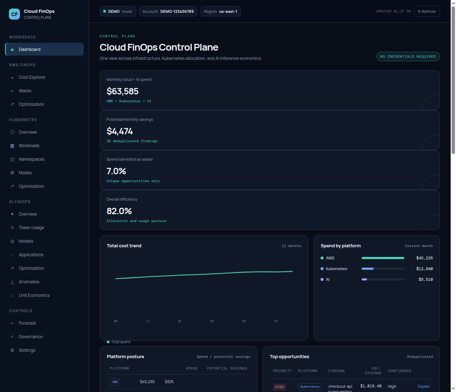

# Cloud FinOps Control Plane

**AWS + Kubernetes + AI cost visibility, allocation, waste detection, governance, and optimization.**

This repository extends the original AWS FinOps CLI into a portfolio-ready control plane. It preserves `finops.py` for CLI compatibility and adds a FastAPI backend plus a React dashboard. Demo mode uses the same data, analysis, API, and frontend path as live mode, so the product can be explored without cloud credentials.



> **Permanent demo site:** [aliihashmiii.github.io/aws-finops-platform](https://aliihashmiii.github.io/aws-finops-platform/)

The public site is a credential-free, read-only demo powered by repository-local JSON fixtures. The FastAPI deployment remains available for live AWS, Kubernetes, and normalized AI telemetry integrations.

## Product overview

The control plane closes three measurable optimization loops:

```text
AWS:         Infrastructure → Usage → Cost → Waste → Optimization
Kubernetes:  Requests → Actual Usage → Allocation → Efficiency → Rightsizing
AI:          Tokens → Model → Cost → Latency/Quality → Optimization
```

The centerpiece is cost intelligence and actionable recommendations, not a chatbot. Every recommendation includes a stable identity, platform, resource, category, estimated monthly savings, confidence, risk, source, and deterministic explanation. Savings are aggregated from unique finding identities so the same opportunity cannot be counted twice.

## Architecture

```text
AWS Cost Explorer / CloudWatch / EC2 / EBS / RDS
Kubernetes API / Prometheus / kube-state-metrics
Normalized AI usage telemetry
                 ↓
         Collectors + demo data
                 ↓
       Unified FinOpsService engine
                 ↓
               FastAPI
                 ↓
        React control-plane dashboard
```

The repository remains Python-first to preserve the original project and its CLI. The dashboard is a React 18 client that can be served directly by FastAPI or published as a static GitHub Pages project site. The static build uses the same deterministic demo responses as the backend and falls back from `/api/*` calls to `frontend/demo-api/*.json`. It does not claim a Next.js runtime that is not present in this repository.

## Implemented capabilities

| Domain | Implemented now | Data posture |
| --- | --- | --- |
| AWS FinOps | Cost breakdown by service, region, team, and environment; EC2/EBS/snapshot/EIP/RDS findings; tag governance; cost history; forecasting scenarios | Demo mode is complete. Live mode uses read-only boto3 collection and surfaces partial AWS errors. |
| Kubernetes FinOps | Cluster, node, namespace, workload, requests-vs-usage efficiency, unallocated cost, replica and rightsizing findings | Demo mode is complete. Live discovery is an extension point; Prometheus and kube-state-metrics are required for usage-grade allocation. |
| AI FinOps | Provider-neutral usage records, model/application allocation, token math, cost per request and per 1K tokens, caching/context/output/model recommendations, anomaly and unit-economics views | Demo mode is complete. Live mode accepts normalized JSON telemetry through `FINOPS_AI_USAGE_FILE`. |
| Cross-platform | Unified recommendations, stable finding identities, savings deduplication, deterministic explanations, partial-data warnings, configurable thresholds | Implemented through `FinOpsService` and the API routes. |

## Demo mode

Demo mode is the default and requires no AWS credentials, Kubernetes cluster, Prometheus server, kube-state-metrics, or AI provider credentials.

```bash
python3 -m venv .venv
source .venv/bin/activate
pip install -r requirements.txt
python finops.py --demo
python3 -m uvicorn backend.main:app --reload
```

Open [http://127.0.0.1:8000](http://127.0.0.1:8000). The demo dataset includes AWS services and resources, a multi-node Kubernetes cluster with namespaces and workloads, and multiple AI providers and models. Totals reconcile across platform views.

### Permanent static website

The repository includes a ready-to-publish static artifact under `docs/`. In GitHub, open **Settings → Pages**, choose **Deploy from a branch**, select `main`, select the `/docs` folder, and save. GitHub Pages will publish the project-site URL shown above. The site is intentionally read-only in static mode: settings changes are previewed locally but are not written to `config.yaml` without the FastAPI backend. Run `python3 scripts/generate_static_demo.py` after changing demo service behavior so both `frontend/demo-api/` and `docs/demo-api/` stay synchronized.

## Live mode

Set `application.mode` to `live` in `config.yaml`, or instantiate `FinOpsService(mode="live")` from an integration. AWS uses the standard boto3 credential chain and read-only API calls. Kubernetes discovery uses kubeconfig or in-cluster credentials when the optional `kubernetes` package is installed. AI live analysis reads normalized records from a file rather than accepting provider secrets in the browser.

```bash
FINOPS_AI_USAGE_FILE=/secure/path/ai-usage.json python3 -m uvicorn backend.main:app
```

A normalized AI usage record must contain `provider`, `model`, `timestamp`, `application`, `team`, `environment`, `input_tokens`, `output_tokens`, `request_count`, `latency_ms`, and `cost`. `cache_hit_rate` is optional.

## Configuration

`config.yaml` is loaded by `ConfigService` and controls the engine, API, and settings screen. The key thresholds are:

```yaml
analysis:
  idle_cpu_threshold: 5.0
  idle_days: 7
  old_snapshot_days: 90

governance:
  required_tags:
    - Environment
    - Team
    - CostCenter

forecast:
  horizon_months: 6
  growth_rate: 0.05

kubernetes:
  cpu_efficiency_threshold: 0.40
  memory_efficiency_threshold: 0.50
  node_utilization_threshold: 0.30
  safety_margin: 0.20

ai_finops:
  monthly_budget: 5000
  alert_threshold: 80
  high_cost_request: 0.10
```

The settings screen updates the allow-listed analysis values and writes them back to `config.yaml`. Required governance tags remain explicit policy rather than frontend-only labels.

## API reference

All endpoints return `status`, `mode`, `last_updated`, and `warnings` when applicable. A partial response is not silently converted to zero.

| Endpoint | Purpose |
| --- | --- |
| `GET /api/health` | Service health and available capabilities |
| `GET /api/mode` | Demo/live mode, account, region, and warnings |
| `GET /api/dashboard` | Unified spend, savings, platform posture, trend, and top findings |
| `GET /api/costs` | AWS service, region, team, and environment cost views |
| `GET /api/cost-history` | AWS + Kubernetes + AI historical series |
| `GET /api/waste` | Positive-savings findings grouped as waste categories |
| `GET /api/recommendations` | Deduplicated cross-platform recommendation queue |
| `GET /api/recommendations/{id}` | Deterministic explanation for one finding |
| `GET /api/forecast` | Baseline, conservative, and aggressive scenario model |
| `GET /api/governance` | AWS tag, Kubernetes policy, and AI budget posture |
| `GET /api/settings` | Current engine settings |
| `PATCH /api/settings` | Update allow-listed runtime settings |
| `GET /api/kubernetes/overview` | Cluster cost, allocation, utilization, namespaces, workloads, and findings |
| `GET /api/kubernetes/clusters` | Cluster inventory |
| `GET /api/kubernetes/nodes` | Node capacity and utilization |
| `GET /api/kubernetes/namespaces` | Namespace showback allocation |
| `GET /api/kubernetes/workloads` | Workload requests, usage, efficiency, and savings |
| `GET /api/kubernetes/recommendations` | Kubernetes-only optimization queue |
| `GET /api/kubernetes/cost-history` | Kubernetes cost history |
| `GET /api/ai/overview` | Spend, tokens, blended cost, models, applications, and findings |
| `GET /api/ai/usage` | Normalized AIUsage records |
| `GET /api/ai/cost-history` | AI cost history |
| `GET /api/ai/models` | Provider/model economics |
| `GET /api/ai/applications` | Application, team, environment, and unit-cost allocation |
| `GET /api/ai/recommendations` | AI optimization queue |
| `GET /api/ai/anomalies` | Spend and token anomaly queue |
| `GET /api/ai/unit-economics` | Cost per request, ticket, document, and 1K requests |

Interactive API documentation is available at `/docs` while the backend is running.

## Cost allocation and optimization methodology

AWS cost visibility uses Cost Explorer groupings when live billing access is available and uses internally consistent service, region, team, and environment totals in demo mode. Resource findings are estimates unless backed by authoritative billing or pricing data.

Kubernetes allocation separates node cost into CPU and memory allocation, then aggregates to workloads and namespaces. Unallocated cluster cost remains visible and is not treated as savings. CPU efficiency is `actual CPU usage / CPU request`; memory efficiency is `actual memory usage / memory request`. Recommended requests include the configured safety margin and must be validated against sustained usage, SLOs, disruption budgets, and workload constraints.

AI usage is normalized before analysis. Token totals equal input plus output tokens. Cost per 1K tokens equals `cost / total_tokens * 1,000`; cost per request equals `cost / request_count`. Model substitution, caching, prompt reduction, routing, batching, and output controls are evaluations with confidence and risk rather than guaranteed savings.

Every finding uses the identity `platform + resource_id + category`. `dedupe_findings()` keeps one finding per identity, and `total_savings()` sums only the deduplicated collection. This is the critical control against savings double-counting.

## Security and permissions

Never commit AWS access keys, provider secrets, kubeconfigs, or telemetry containing sensitive payloads. Use environment variables, the AWS credential chain, IAM roles/profiles, standard Kubernetes service-account or kubeconfig mechanisms, and provider-specific secret stores. The analysis path is intended to be read-only.

For AWS live mode, grant only the read permissions required by the enabled collectors, such as `sts:GetCallerIdentity`, `ce:GetCostAndUsage`, `ec2:DescribeInstances`, `ec2:DescribeVolumes`, `ec2:DescribeSnapshots`, `ec2:DescribeAddresses`, `rds:DescribeDBInstances`, and `cloudwatch:GetMetricStatistics`. Cost Explorer is regionalized through `us-east-1` by AWS. Review and narrow permissions for the account and regions in which the collector runs.

For Kubernetes live mode, grant read access to nodes, namespaces, pods, deployments, stateful sets, and resource metadata. Prometheus and kube-state-metrics are needed for usage, request, limit, and replica telemetry. The current collector intentionally reports a partial-data warning when those sources are not available.

## Repository map

```text
backend/
  main.py                         FastAPI application and static frontend host
  routes/                         Dashboard, AWS, Kubernetes, AI, and compatibility routes
  services/                       Configuration and unified FinOps service
  schemas/models.py               Typed request and response models
finops/
  demo_data.py                    Deterministic three-domain dataset
  aws/collector.py                Read-only AWS collector
  kubernetes/                     Collector and calculation modules
  ai/usage.py                     Normalized AIUsage loader
  models/findings.py              Finding identity and deduplication
frontend/
  index.html                      React shell
  app.js                          API-backed dashboard client with static fallback
  styles.css                      Enterprise dark UI system
  demo-api/                       Generated read-only fixtures for GitHub Pages
  vendor/                         Locally vendored React runtime
scripts/
  generate_static_demo.py         Refresh static fixtures from the FinOps service
docs/
  index.html                      Branch-based GitHub Pages artifact
  app.js, styles.css              Static dashboard assets
  demo-api/                       Generated read-only fixtures
  vendor/                         Locally vendored React runtime
finops.py                         Original CLI compatibility layer
config.yaml                       Application configuration
 tests/                           Calculation and API-engine tests
```

## Testing and validation

```bash
python3 -m compileall -q .
python3 -m pytest -q
python3 -m uvicorn backend.main:app
```

The test suite covers AWS thresholds, Kubernetes efficiency and safe requests, AI token/cost calculations, forecasting scenarios, governance gaps, and the duplicate-finding control. The validated demo path loads the dashboard, AWS, Kubernetes, AI, forecast, governance, and settings views through the API.

## Known limitations

Live AWS resource pricing is not inferred from hard-coded approximate values. Where Cost Explorer or pricing data is unavailable, the API surfaces a partial warning rather than presenting a false zero. Live Kubernetes discovery currently proves API connectivity but requires Prometheus and kube-state-metrics for usage-grade allocation. Live AI integrations are intentionally provider-neutral and currently use normalized JSON telemetry; direct OpenAI, Anthropic, Google, Azure OpenAI, and Bedrock adapters are extension points. No automatic remediation is implemented.

## Roadmap

The following items are explicitly **not implemented** in this version: AWS Pricing API enrichment, Compute Optimizer and Cost Optimization Hub integration, Savings Plans optimization, AWS Organizations multi-account support, production Prometheus and kube-state-metrics adapters, EKS-specific allocation, multi-cluster support, autoscaler optimization, OpenTelemetry LLM telemetry, more provider adapters, quality-aware routing, semantic caching, AI forecasting, an LLM-based FinOps analyst, FOCUS normalization, policy-as-code, automated remediation, and budget workflow integrations.

## Legacy CLI

The original CLI remains available:

```bash
python finops.py --demo
python finops.py --analyze
python finops.py --waste
python finops.py --forecast 12
python finops.py --analyze --format json --output data.json
```

## License

This project is licensed under the MIT License. See [LICENSE](LICENSE).
